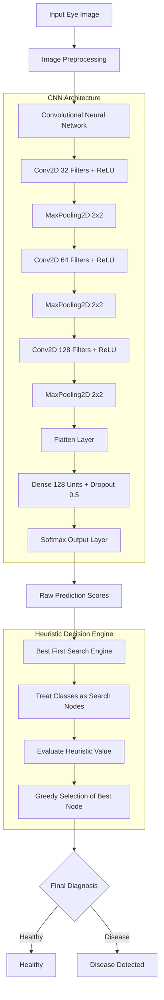

# Eye Disease Detection System

An AI-powered medical image classification system that combines a Convolutional Neural Network (CNN) built with TensorFlow/Keras and a Best First Search (BFS) heuristic decision algorithm for accurate ocular disease detection.

---

## Project Overview

Ocular diseases can lead to severe vision loss if not detected early. This project provides an automated pipeline to analyze eye images and classify them into Healthy or Diseased categories.

The system utilizes a 3-block Deep Learning CNN to extract visual spatial features from retinal and eye images, followed by a Best First Search (BFS) search algorithm that acts as a heuristic decision layer to determine the most probable diagnostic output.

---

## System Architecture & Flowchart



---

## Features & Highlights

- **Deep Learning Feature Extraction**: 3-stage CNN feature learning with dropout regularization to prevent overfitting.
- **Best First Search (BFS) Heuristic**: Implements an informed search algorithm to evaluate prediction nodes greedily based on probability heuristics.
- **Automated Data Pipeline**: Built-in dataset preparation, directory generator, and dummy dataset creation scripts for testing.
- **Interactive CLI Interface**: Command-line diagnostic interface for testing individual image paths in real-time.

---

## Project Structure

```text
Eye-Disease-detection-system/
│
├── dataset/                    # Dataset directory
│   ├── healthy/                # Healthy eye samples
│   └── disease/                # Disease eye samples
│
├── check_indices.py            # Utility to verify dataset class index mapping
├── eye_disease_detection.py    # Main training, CNN model, BFS, & detection script
├── generate_dummy_data.py      # Helper script to generate synthetic test dataset
├── eye_disease_model.h5        # Saved Keras trained model weights
├── requirements.txt            # Python dependencies
├── .gitignore                  # Git untracked rules
└── README.md                   # Project documentation
```

---

## Getting Started

### 1. Prerequisites
Ensure you have Python 3.8+ installed on your system.

### 2. Installation
Clone the repository and install the required dependencies:

```bash
# Clone the repository
git clone https://github.com/Hari-KD/Eye-Disease-detection-system.git
cd Eye-Disease-detection-system

# Create and activate a virtual environment (optional but recommended)
python -m venv .venv
# On Windows:
.venv\Scripts\activate
# On Linux/macOS:
source .venv/bin/activate

# Install dependencies
pip install -r requirements.txt
```

---

## Running the System

### Option A: Generate Synthetic Test Dataset (Quick Test)
If you don't have a dataset ready, generate sample synthetic images:
```bash
python generate_dummy_data.py
```

### Option B: Verify Class Mapping
```bash
python check_indices.py
```

### Option C: Run Eye Disease Detection
Run the main script to train the model and start interactive detection:
```bash
python eye_disease_detection.py
```
When prompted, enter the path to an image (e.g., `dataset/disease/sample_0.jpg`).

---

## Tech Stack & Dependencies

- **Language**: Python 3.x
- **Framework**: TensorFlow 2.x / Keras
- **Libraries**: NumPy, Pillow (PIL)
- **VCS**: Git & GitHub

---

## License

This project is open-source and available under the MIT License.
