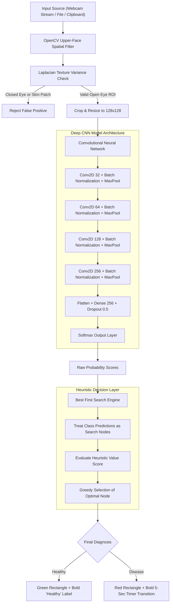

# Eye Disease Detection System

An AI-powered medical image classification system that combines a retrained Convolutional Neural Network (CNN) built with TensorFlow/Keras, OpenCV spatial eye localization, and a Best First Search (BFS) heuristic decision algorithm for real-time and manual ocular disease detection.

---

## Project Overview

Ocular diseases can cause irreversible vision impairment if not identified early. This project provides a full-stack web application and diagnostic pipeline that performs real-time eye detection via webcam scanning as well as manual image analysis through file upload or clipboard pasting.

The core pipeline utilizes OpenCV Haar Cascades constrained to upper-face spatial regions to detect open eyes, filters out closed eyes and non-eye facial features using Laplacian texture analysis, and classifies eye health using a deep CNN coupled with a Best First Search (BFS) heuristic engine.

---

## System Architecture & Flowchart



---

## Key Features

1. **Real-Time Camera Scan**:
   - Streams live webcam video using HTML5 WebRTC.
   - Detects eyes frame-by-frame and renders real-time bounding boxes directly on the live camera canvas.

2. **Bounding Box & Label Rules**:
   - **Healthy Eyes**: Highlighted in a **Green** rectangle with a **bold "Healthy"** text badge positioned at the top-right corner.
   - **Unhealthy Eyes**: Highlighted in a **Red** rectangle with a **5-second timer transition**:
     - **0 to 5 seconds**: Displays a **bold "Unhealthy"** text badge at the top-right corner.
     - **5 to 10 seconds (and onwards)**: Displays a **bold "Disease detected"** text badge at the top-right corner.

3. **Closed-Eye & Facial Feature Safeguards**:
   - Restricts eye detection strictly to the upper 15% to 55% region of detected faces.
   - Applies Laplacian contrast variance thresholds to reject closed eyes, skin patches, nostrils, or hair.

4. **Manual Check Dropbox with Clipboard Paste (Ctrl+V)**:
   - Allows users to analyze eye images via drag-and-drop or file browser selection.
   - Supports direct **Ctrl+V clipboard pasting** of images from screenshots or clipboard memory.

5. **Balanced CNN Model Retraining**:
   - Deep CNN architecture trained on the 1,500+ image dataset (`dataset/healthy` and `dataset/disease`).
   - Integrates class weight balancing to achieve high classification accuracy across both healthy and diseased samples.

---

## Project Structure

```text
Eye-Disease-detection-system/
│
├── dataset/                    # Primary dataset directory
│   ├── healthy/                # Healthy ocular image samples
│   └── disease/                # Disease ocular image samples
│
├── app.py                      # Main Flask web server & web UI interface
├── train_model.py              # CNN model training script with class weighting
├── eye_disease_detection.py    # CLI detection pipeline & BFS implementation
├── check_indices.py            # Utility script to check class index mapping
├── generate_dummy_data.py      # Helper script for synthetic test dataset generation
├── eye_disease_model.h5        # Trained Keras neural network model weights
├── requirements.txt            # Python dependencies
├── .gitignore                  # Git untracked file rules
└── README.md                   # Project documentation
```

---

## Getting Started

### Prerequisites

- Python 3.8 or higher installed on your system.

### Installation

1. Clone the repository:
   ```bash
   git clone https://github.com/Hari-KD/Eye-Disease-detection-system.git
   cd Eye-Disease-detection-system
   ```

2. Create and activate a virtual environment:
   - On Windows:
     ```bash
     python -m venv .venv
     .venv\Scripts\activate
     ```
   - On Linux/macOS:
     ```bash
     python -m venv .venv
     source .venv/bin/activate
     ```

3. Install required dependencies:
   ```bash
   pip install -r requirements.txt
   ```

---

## Running the Application

### 1. Launch the Web Interface

Start the Flask application server:

```bash
python app.py
```

Open your web browser and navigate to:
```
http://127.0.0.1:5000
```

### 2. Retrain the CNN Model (Optional)

To retrain the neural network on the dataset using balanced class weighting:

```bash
python train_model.py
```

### 3. Run Interactive CLI Detection (Terminal Mode)

To run the terminal-based interactive detector:

```bash
python eye_disease_detection.py
```

---

## Tech Stack

- **Backend**: Python 3, Flask, OpenCV (`opencv-python`), NumPy, Pillow, Scikit-learn
- **Machine Learning**: TensorFlow 2.x, Keras
- **Frontend**: HTML5, Vanilla CSS3 (Glassmorphism), JavaScript (WebRTC, HTML5 Canvas)
- **Version Control**: Git & GitHub

---

## License

This project is open-source and available under the MIT License.
